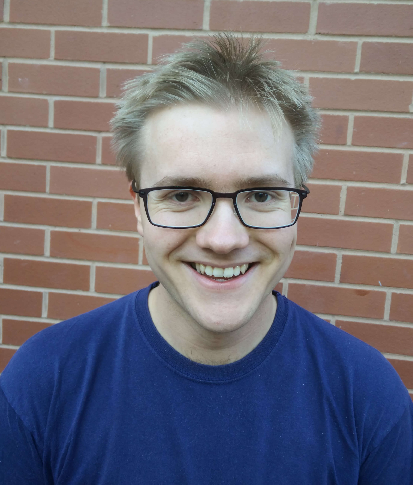

# COM3529 – Software Testing and Analysis   Spring Semester 2025

Welcome! This repository code examples, practical sheets, and slides to support the Spring Semester module COM3529 "Software Testing and Analysis" at the University of Sheffield.

Jump to:
- [COM3529 – Software Testing and Analysis  Spring Semester 2025](#com3529-software-testing-and-analysis--spring-semester-2025)
  - [1. Teaching Staff](#1-teaching-staff)
  - [2. Schedule and Materials](#2-schedule-and-materials)
    - [Lectures](#lectures)
    - [Practical Sessions (Labs)](#practical-sessions-labs)
  - [3. Assessment](#3-assessment)

## 1. Teaching Staff

  | |  |  |  |
  |:-:|:-:|:-:|:-:|
  | **[Phil McMinn](https://philmcminn.com)**   Lecturer   Weeks 1&ndash;4 | **[José Rojas](https://jmrojas.github.io)**   Lecturer   Weeks 5 &amp; 9&ndash;11 | **[Owain Parry](https://o-parry.github.io/)**   Guest Lecturer   Week 7 | **[Michael Foster](https://jmafoster1.github.io/)**   Guest Lecturer   Week 8|

  | |  |  |
  |:-:|:-:|:-:|
  |**Islam Elgendy**   Teaching Assistant | **Megan Maton**   Demonstrator | **Ruizhen (Rui) Gu**   Demonstrator|

## 2. Schedule and Materials

<!-- [Defects, Infections and Failures](practicals/2-defects-infections-failures.md) | -->

| Week | Lecture | Practical Session |
|-:|-|-|
|1 | **[Introduction](slides/1-introduction.pdf)**<ul><li>Beizer's Maturity Model</li><li>Why finding all bugs is impossible</li><li>How software failures happen (the RIPR model)</li></ul>| [Getting Started](practicals/1-getting-started.pdf) |
|2 | **[Testing Big and Small Part 1](slides/2-testing-big-small-1.pdf)**<ul><li>Test Automation</li><li>Testing Scope (The Test Triangle)</li><li>Unit Testing Part 1<ul><li>Avoiding Brittle Tests</li></ul></li></ul> | [Defects, Infections and Failures](practicals/2-defects-infections-failures.md) ([Solutions](practicals/2-defects-infections-failures-solutions.md))|
|3 | **[Testing Big and Small Part 2](slides/3-testing-big-small-2.pdf)**<ul><li>Unit Testing Part 2<ul><li>Writing Clear Unit Tests</li></ul><li>Test Doubles</li></ul> | [Better Unit Testing](practicals/3-better-unit-testing.md) ([Solutions](practicals/3-better-unit-testing-solutions.md)) |
|4 | **[Testing Big and Small Part 3](slides/4-testing-big-small-3.pdf)**<ul><li>Larger Tests</li></ul>**[Coverage Criteria, Part 1](slides/4-coverage-part1.pdf)**<ul><li>Introduction to Coverage Criteria</li></ul> | [Test Doubles](practicals/4-test-doubles.md) ([Solutions](practicals/4-test-doubles-solutions.md)) and [Test Coverage](practicals/4-coverage.md) ([Solutions](practicals/4-coverage-solutions.md))|
|5 | **Coverage Criteria, Part 2**<ul><li>[Control Flow Analysis and Testing](slides/5-control-flow-analysis-and-testing.pdf)</li><li>[Logic Analysis and Testing](slides/5-logic-analysis-and-testing.pdf)</li><li>[Conclusions on Coverage](slides/5-conclusions.pdf)</li></ul> | [Control Flow Graphs and Logic Testing](practicals/5-cfgs-and-logic.md) ([Solutions](practicals/5-cfgs-and-logic-solutions.md)) |
|6 | *No lecture* | *No practical class* |
|7 | [**Regression Testing**](slides/7-regression.pdf) (Guest lecturer: [Dr Owain Parry](https://o-parry.github.io/)) | [Regression Testing in Practice](practicals/7-regression-testing.md) ([Solutions](practicals/7-regression-testing-solutions.md)) |
|8 | **[Model-Based Testing](slides/8-MBT.pdf)** ([slides with overlays](slides/8-MBT-overlays.pdf)) (Guest lecturer: [Dr Michael Foster](https://jmafoster1.github.io/)) | [MBT Exercises](practicals/8-MBT.md) ([Solutions](practicals/8-MBT-solutions.md)) |
|Easter| | |
|9 | **[Mutation Testing](slides/9-mutation.pdf)** | [Code Defenders](practicals/9-CodeDefenders.pdf) |
|10 | **[Search-Based Test Generation](slides/10-sbst.pdf)** | [The EvoSuite Tool](practicals/10-evosuite-demo/evosuite-demo.md) |
|11| **[Fuzzing](slides/11-fuzz-testing.pdf)** | [Your First Fuzzer](practicals/11-fuzzing.md) ([Solution](practicals/11-fuzzing-solution/)) |

### Lectures

Lectures will be held on **Tuesdays 3-4pm, [Broad Lane Block, Mappin Building](https://sites.google.com/sheffield.ac.uk/pooledroomdirectory/teaching-spaces/broad-lane-block-mappin-building),  Lecture Theatre 7**.

### Practical Sessions (Labs)

Practical Sessions (Labs) will be held on **Fridays 5-6pm in Computer Room 1 on level 2 of the [Diamond](https://www.sheffield.ac.uk/engineering/diamond-engineering/floor-plans)**. These sessions will be a mix of coding and paper/pen exercises that are designed to help you prepare for the exam, based on that week's lecture materials. You'll need to bring your own laptop to the session, and have Java 11 or better installed on it. More information can be found in the **Getting Started** slides from week 1's practical session. You can use the laptop loan facility if you wish.

## 3. Assessment

COM3529 is assessed 100% by an exam, to be scheduled in the exam period of Weeks 13&ndash;15.

**The practical sessions are designed to prepare you with exercises that will be similar to questions asked in the exam**.

The exam may feature questions **requiring you to write Java code**. This code
needs to be **syntactically correct** and may involve writing JUnit tests that
call methods in libraries studied in the module (e.g., mocking libraries).
